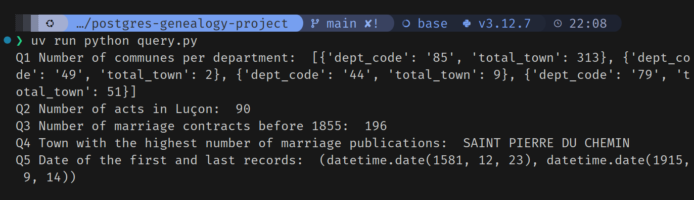
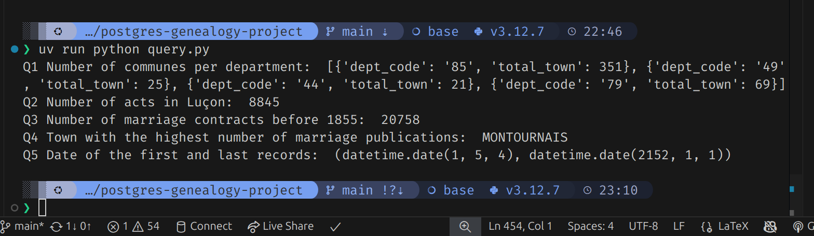

# postgres-genealogy-project
group project on db design + ETL pipeline w/ postgresql

To install dependencies + set up environment:
```bash
#Install uv if you don't have it yet
curl -LsSf https://astral.sh/uv/install.sh | sh
uv sync
```

To run main():
```bash
uv run python main.py --csv raw_data/mariages_L3_5k.csv --truncate
```

To execute queries and see the results:
```bash
uv run python query.py
```

To install LaTeX: (VERY HEAVY, AROUND 2-3 GB CAREFUL)
```bash
sudo apt install texlive-latex-recommended
sudo apt install texlive-publishers
sudo apt install texlive-science
sudo apt install texlive-lang-cjk
sudo apt install chktex
```

To compile LaTeX:
```bash
#Inside ./report
pdflatex main.tex
```

Alternative: Docker (if you have troubles with dependencies hell :C )

see [Latex Compile Manual](LATEX_COMPILE.md)

## Some Figures

<div style="text-align:center">
    
    <p> ETL Pipeline </p>
    
    <p> Results for 5k dataset </p>
    
    <p> Results for 564k bonus dataset </p>
</div>

## Report

[See our report here](./report/main.pdf)