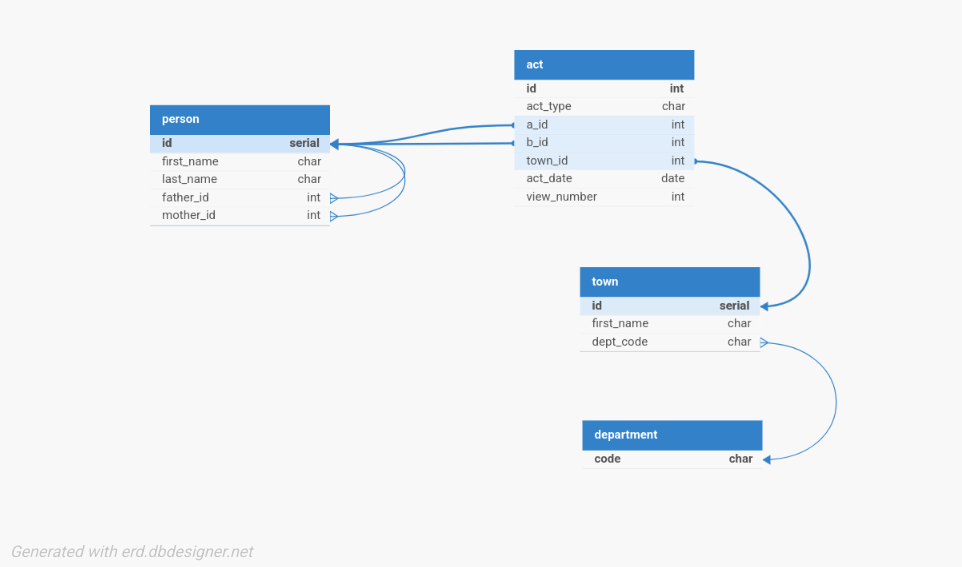

## 1. Normalization

### a) Initial fields

1. Act ID
2. Act Type
3. Person A's last name
4. Person A's first name
5. First name of A's father
6. Last name of A's mother
7. First name of A's mother
8. Person B's last name
9. Person B's first name
10. First name of B's father
11. Last name of B's mother
12. First name of B's mother
13. Town (Commune)
14. Department
15. Date
16. View number

### b) Normalization Process

- **1NF**:
  - All values are atomic (each cell contains one piece of data).
  - Each record is uniquely identified by an Act ID.
  - => Result: 1NF achieved.

- **2NF**:
  - **Problem**: Repetition of data for parents, towns, and departments leads to redundancy.
  - **Solution**: Separate entities so that every non-key attribute depends on the whole primary key.
  - **Functional Dependencies**:

    ```
    - Act_ID → (Type, Date, View_Num, Commune_ID, Person_A_ID, Person_B_ID)

    - Person_ID → (Last_Name, First_Name, Father_ID, Mother_ID)

    - Commune_ID → (Name, Dept_Code)
    ```

  - => Result: 2NF achieved.

- **3NF**:
  - **Problem**:
    - Transitive Dependency: The Department depended on the Town, which depended on the Act.
    - Parental names depended on the person.
  - **Solution**:
    - Extracted **Department** into a standalone table to enforce valid codes (44, 49, 79, 85).
    - Established foreign keys (`father_id`, `mother_id`) within the **Person** table to handle lineage without repeating names.
  - => Result: 3NF achieved.

### c) Final Functional Dependencies:

```
Act_ID → (Act_Type, Date, View_Num, Commune_ID, Person_A_ID, Person_B_ID)

Person_ID → (Last_Name, First_Name, Father_ID, Mother_ID)

Commune_ID → (Commune_Name, Dept_Code)

Dept_Code → (Valid_Codes: 44, 49, 79, 85)
```

## 2. Relational Schema



## 3. PostgreSQL Table Creation

```sql
CREATE TABLE IF NOT EXISTS "department" (
  "code" varchar(2) PRIMARY KEY
  CONSTRAINT "chk_valid_dept" CHECK ("code" IN ('44', '49', '79', '85'))
);

CREATE TABLE IF NOT EXISTS "town" (
  "id" SERIAL PRIMARY KEY,
  "name" varchar(255) NOT NULL,
  "dept_code" varchar(2) NOT NULL,
  FOREIGN KEY ("dept_code") REFERENCES "department"("code")
);

CREATE TABLE IF NOT EXISTS "person" (
  "id" SERIAL PRIMARY KEY,
  "last_name" varchar(255) NOT NULL,
  "first_name" varchar(255) NOT NULL,
  "father_id" integer REFERENCES "person"("id"),
  "mother_id" integer REFERENCES "person"("id")
);

CREATE TABLE IF NOT EXISTS "act" (
  "id" integer PRIMARY KEY,
  "act_type" varchar(50) NOT NULL,
  "a_id" integer NOT NULL REFERENCES "person"("id"),
  "b_id" integer NOT NULL REFERENCES "person"("id"),
  "town_id" integer NOT NULL REFERENCES "town"("id"),
  "act_date" date NOT NULL,
  "view_num" integer,
  CONSTRAINT "chk_act_type" CHECK ("act_type" IN (
        'Certificat de mariage',
        'Contrat de mariage',
        'Divorce',
        'Mariage',
        'Promesse de mariage - fiançailles',
        'Publication de mariage',
        'Rectification de mariage'
    ))
);
```
